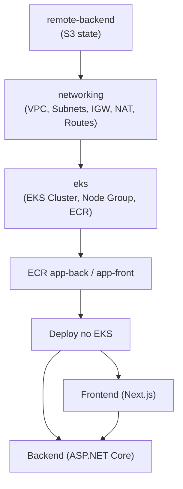

# tf-eks-gitops-karpenter

Infraestrutura e aplicação de exemplo para Kubernetes na AWS com foco em:

- Provisionamento de rede e EKS com Terraform
- Repositórios ECR para imagens de frontend e backend
- Aplicação full stack (Next.js + ASP.NET Core)
- Base para fluxo GitOps e uso de Karpenter (ainda não implementado neste repositório)

## Visão geral da arquitetura

O projeto está organizado em três camadas principais de infraestrutura e uma camada de aplicação:

1. `remote-backend/`: cria bucket S3 para `terraform remote state` com lock e versionamento configurado. 
2. `networking/`: cria VPC, subnets públicas/privadas, IGW, NAT e rotas.
3. `eks/`: cria cluster EKS, node group gerenciado e repositórios ECR.
4. `app/`: contém backend ASP.NET Core e frontend Next.js para empacotamento em containers.

## Flowchart do projeto



## Estrutura do repositório

```txt
.
├── app/
│   ├── backend/YoutubeLiveApp/           # API ASP.NET Core (.NET 8)
│   └── frontend/youtube-live-app/        # Frontend Next.js 14
├── eks/                                  # Terraform do cluster EKS e ECR
├── networking/                           # Terraform de VPC/subnets/rotas
└── remote-backend/                       # Terraform do bucket S3 de estado remoto
```

## Stack utilizada

- Terraform 
- AWS
- .NET 8 (backend)
- Node.js 21 + Next.js 14 (frontend)
- Docker (build local de imagens)

## Pré-requisitos

- Conta AWS com permissões para VPC, EKS, IAM, ECR e S3
- AWS CLI configurada localmente
- Perfil AWS 
- Terraform instalado
- Docker instalado (se for testar build das imagens)
- `kubectl` (para operar o cluster após provisionamento)

## Ordem recomendada de provisionamento

> Este projeto usa `remote state` em S3 nos diretórios `networking/` e `eks/`.

1. Criar backend remoto:

```bash
cd remote-backend
terraform init
terraform apply
```

2. Provisionar rede:

```bash
cd ../networking
terraform init
terraform plan
terraform apply
```

3. Provisionar EKS e ECR:

```bash
cd ../eks
terraform init
terraform plan
terraform apply
```

## Aplicação

### Backend (`app/backend/YoutubeLiveApp`)

- API ASP.NET Core com endpoint de saúde e endpoint de exemplo (`WeatherForecast`)
- `Program.cs` publica as rotas sob prefixo `/backend`
- Dockerfile multi-stage para build e runtime em .NET 8

Build local da imagem:

```bash
cd app/backend/YoutubeLiveApp
docker build -t youtube-live-app-backend:local .
```

### Frontend (`app/frontend/youtube-live-app`)

- Projeto Next.js 14 inicial (template padrão)
- Dockerfile multi-stage com build e execução via `npm start`

Execução local (sem Docker):

```bash
cd app/frontend/youtube-live-app
npm ci
npm run dev
```

Build local da imagem:

```bash
cd app/frontend/youtube-live-app
docker build -t youtube-live-app-frontend:local .
```

Projeto derivado da Imersão Devops Na Nuvem do Kenerry Serain.